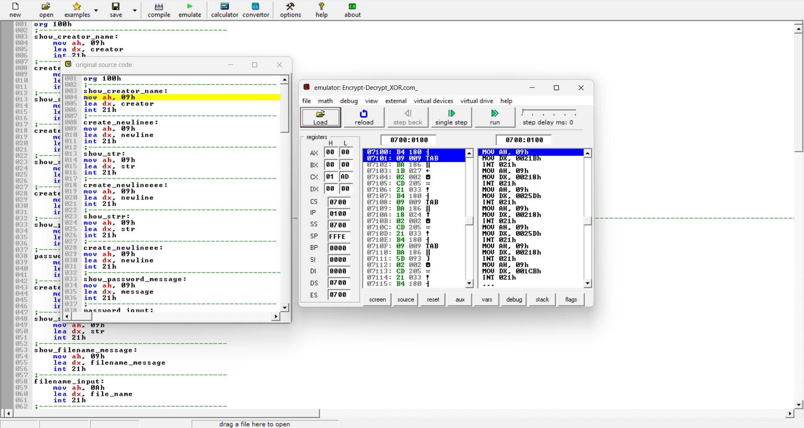
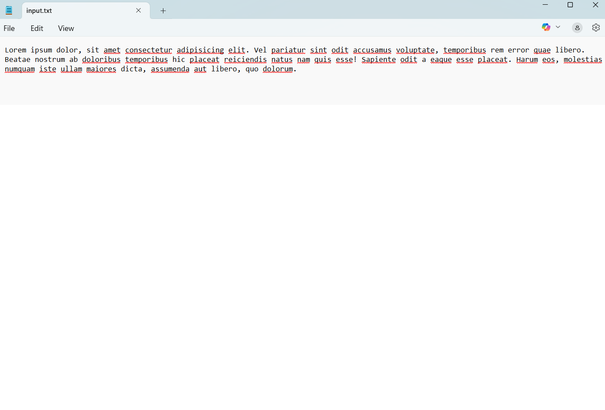
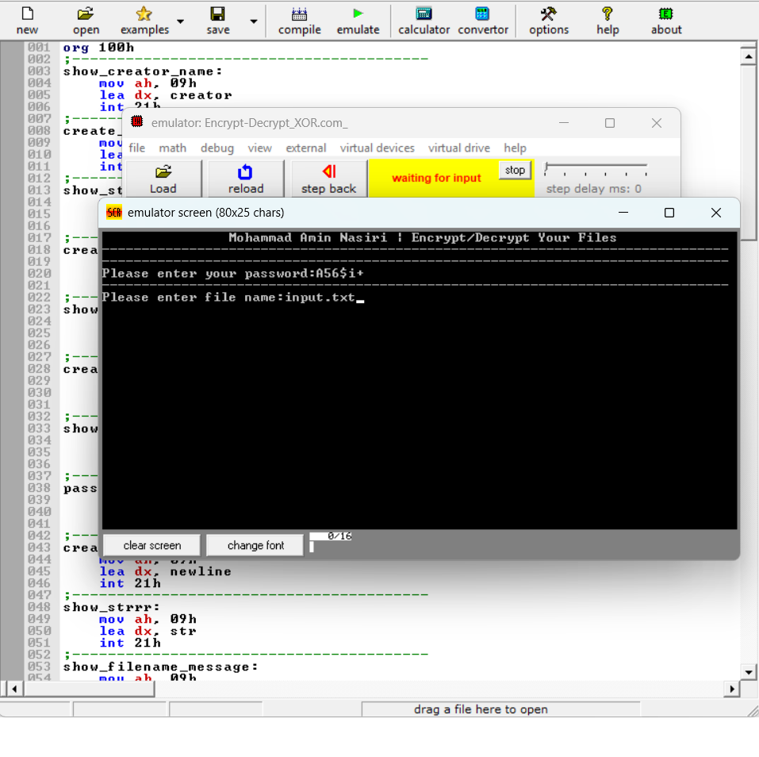
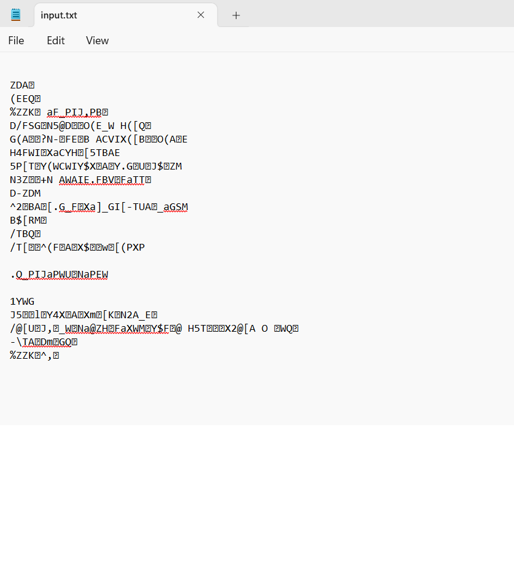

# Encrypt-Decrypt_asm8086

# 🔐 Assembly File Encryption & Decryption

A simple but effective 8086 Assembly language tool for encrypting and decrypting text files using a password-based XOR cipher. This project was created by Mohammad Amin Nasiri and runs on EMU8086 or DOSBox.

---

## 🧩 Features

- 🖊️ Takes both file name and password from the user.
- 🔁 Reversible XOR-based encryption/decryption.
- 📄 Modifies the file in place (same file).
- 🧠 Uses only real-mode DOS interrupts (INT 21h).
- 🏃 100% written in x86 Assembly (EMU8086-compatible).

---

## 📌 How It Works

1. The program displays the author name and a separator.
2. It prompts the user to enter:
   - A password (max 20 characters).
   - A file name (max 20 characters, e.g. `text.txt`).
3. It reads one byte at a time from the specified file.
4. Each byte is XORed with a corresponding character in the password (in a loop).
5. The result is written back to the same file.
6. Running the program again with the same password decrypts the file.

---

## 🔐 XOR Encryption Explained

This program uses a basic but effective XOR encryption method. Each byte from the file is XORed with a corresponding byte from the password.

### Formula:

```
EncryptedByte = OriginalByte XOR PasswordByte
```

This process is reversible. If you XOR the encrypted byte again with the same password byte, you get the original byte:

```
OriginalByte = EncryptedByte XOR PasswordByte
```

The password is looped if the file is longer than the password.

---

## 🧪 Example

```
                Mohammad Amin Nasiri | Encrypt/Decrypt Your Files
-------------------------------------------------------------------------------
Please enter your password:
> mySecret

Please enter file name:
> note.txt

[Encryption/Decryption occurs automatically]
```

---

## 🖼️ Screenshots

### 1. Assembly Source Code in EMU8086


### 2. Original Text File Before Encryption


### 3. Running Program with Password and Filename Input


### 4. Encrypted Output File


---

## 🖥️ Requirements

- EMU8086 IDE or DOSBox with 8086 assembler
- A `.txt` file in the same directory as the executable

---

## 🛠️ How to Run

```bash
1. Open `encryptx86.asm` in EMU8086 IDE
2. Compile and run the program
3. When prompted, enter your password
4. Then, enter the filename of the `.txt` file
5. Encryption/Decryption is done automatically on that file
```

💡 Tip: To decrypt, simply run the program again and enter the same password and file name.

---

## 📁 File Structure

| File              | Description                           |
|-------------------|---------------------------------------|
| Encrypt-Decrypt_XOR.asm | Main source code in x86 Assembly       |
| README.md          | Project documentation                 |
| screenshots/       | Screenshots showing program usage     |

---

## 🧠 Technical Notes

- Uses DOS interrupt 21h:
  - Function 0Ah for input.
  - Function 3Dh, 3Fh, 40h, 42h, and 3Eh for file handling.
- Null-terminates input strings by replacing the Enter (ASCII 13) with zero.
- Displays name and UI using Function 09h with `$`-terminated strings.

---

## ⚠️ Limitations

- Only works on text files (`.txt`), 8-bit encoding assumed.
- No file size limit handling.
- Not secure for serious encryption — educational use only.

---

## 📄 License

MIT License © 2025 Mohammad Amin Nasiri

---

## 🙋 Author

Created by **Mohammad Amin Nasiri** — feel free to fork, use, modify or improve.  
If you find this useful, give it a ⭐ on GitHub!

Happy Hacking! 💻✨
